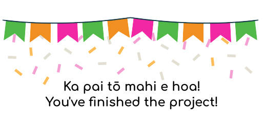

import {
    MatchingActivity,
    MatchTarget,
    TextBox,
    Image,
    Para,
    Box,
    CollapsablePanel,
    MultiChoiceActivity,
} from '../../activities';

import { Button } from '../../../atomic-ui';

import kioskcover from './kiosk-cover.jpg';
import topic1 from './lesson-1-topic-1.jpg';
import heaha1 from './heaha1.png';

import collect from './collect.png';
import organise from './organise.png';
import analyse from './analyse.png';
import fruitexample from './fruitexample.png';
import create_store_share from './create_store_share.png';
import create from './create.png';
import store from './store.png';
import share from './share.png';

import eghardwarebg from './eghardwarebg.png';
import eghardwareinternal from './eghardwareinternal.png';

import hardwareEx from './hardware-external.jpg';
import hardwareIn from './hardware-internal.jpg';
import kaitiakitanga from './kaitiakitanga.jpg';
import tuakana_teina from './tuakana_teina.png';
import whatiskaitiaki1 from './whatiskaitiaki1.png';
import whatistaonga from './whatistaonga.png';

import air from './air-sensor.png';
import battery from './battery-slot.png';
import cpu from './cpu.png';
import light from './light-sensor.png';
import signal from './signal.png';
import soil from './soil-sensor.png';

import litter from './litter.jpg';
import study from './study.jpg';
import walkdog from './walkdog.jpg';
import washhands from './washhands.jpg';

import interaction from './interaction.png';
import information from './information.png';
import insight from './insight.png';

## Introduction {#introduction}

###

Kia ora e te whānau, welcome to the Electric Garden **Online Project** where you can

build on your knowledge of the **Electic Garden**, **data**, and **kaitiakitanga**!

 

Good luck e hoa, and have fun!

## The Electric Garden {#topic-1}

### **What is the Electric Garden?**

 

#### **1.** Which answer best describes the Electric Garden?

<MultiChoiceActivity
    question=""
    choices={[
        {
            label:
                'A digital device that monitors garden conditions by taking measurements with different sensors and sharing data with us',
            correct: true,
            feedback: 'Ka pai',
        },
        {
            label:
                'A new video game where you can design and landscape your own garden using data and measurements from GPS sensors',
            feedback: 'Kāore',
        },
        {
            label:
                'A digital device that uses data to target lightning to strike the garden and use that electric energy to power sensors',
            feedback: 'Kāore',
        },
        {
            label:
                'A sensor that uses data about the garden conditions to automatically water the garden when it gets too dry',
            feedback: 'Kāore',
        },
    ]}
/>

### The Electric Garden Unit

The Electric Garden (EG) unit is a digital device made up of a number of components.

Can you identify all of the main parts on the **outside** and **inside** of the EG?

 

#### **2a.** Label the **external hardware** parts that make up the Electric Garden **unit**

<MatchingActivity
    unmatched={[]}
    feedback={{
        success:
            'Kei te pai, nice job! Now you know the different parts of the EG!',
        fail: 'Not quite, try again!',
    }}
    background={
        <Image
            src={eghardwarebg}
            tooltip="Electric Garden External Hardware"
            width={700}
        />
    }
    direction={{
        candidates: 'down',
        targets: 'right',
    }}
    positions={{ candidates: { top: 0, right: 0 } }}
    targetStyles={{ border: '1px black dashed' }}
    randomOrder={{
        candidates: true,
        targets: false,
    }}
>
    <MatchTarget
        matches={[<TextBox maxWidth={12}>Air Probe</TextBox>]}
        position={{ left: 310, top: 80 }}
    >
        <Box width={50} height={125} />
    </MatchTarget>
    <MatchTarget
        matches={[<TextBox maxWidth={12}>Soil Probe</TextBox>]}
        position={{ left: 178, top: 170 }}
    >
        <Box width={80} height={305} />
    </MatchTarget>
    <MatchTarget
        matches={[<TextBox maxWidth={12}>Light Sensor</TextBox>]}
        position={{ left: 458, top: 292 }}
    >
        <Box width={60} height={60} />
    </MatchTarget>
    <MatchTarget
        matches={[<TextBox maxWidth={12}>Antenna</TextBox>]}
        position={{ left: 565, top: 35 }}
    >
        <Box width={75} height={320} />
    </MatchTarget>
    <MatchTarget
        matches={[<TextBox maxWidth={12}>Device Case</TextBox>]}
        position={{ left: 435, top: 365 }}
    >
        <Box width={142} height={110} />
    </MatchTarget>
</MatchingActivity>

 
 

#### **2b.** Label the **internal hardware** parts that make up the Electric Garden **device**

<MatchingActivity
    unmatched={[]}
    feedback={{
        success:
            'Kei te pai, good spotting! Now you know the all the parts of the EG, inside and out!!',
        fail: 'Not quite, try again!',
    }}
    background={
        <Image
            src={eghardwareinternal}
            tooltip="Electric Garden Internal Hardware"
            width={700}
        />
    }
    direction={{
        candidates: 'down',
        targets: 'right',
    }}
    positions={{ candidates: { top: 0, right: 0 } }}
    randomOrder={{
        candidates: true,
        targets: false,
    }}
>
    <MatchTarget
        matches={[<TextBox maxWidth={12}>Air Sensor Connector</TextBox>]}
        position={{ left: 150, top: 340 }}
    >
        <Box width={100} height={50} />
    </MatchTarget>
    <MatchTarget
        matches={[<TextBox maxWidth={12}>Soil Sensor Connector</TextBox>]}
        position={{ left: 150, top: 120 }}
    >
        <Box width={100} height={50} />
    </MatchTarget>
    <MatchTarget
        matches={[<TextBox maxWidth={12}>Light Sensor</TextBox>]}
        position={{ left: 570, top: 105 }}
    >
        <Box width={100} height={50} />
    </MatchTarget>
    <MatchTarget
        matches={[<TextBox maxWidth={12}>Antenna Connector</TextBox>]}
        position={{ left: 150, top: 225 }}
    >
        <Box width={100} height={50} />
    </MatchTarget>
    <MatchTarget
        matches={[<TextBox maxWidth={12}>SIM Card Slot</TextBox>]}
        position={{ left: 570, top: 195 }}
    >
        <Box width={100} height={50} />
    </MatchTarget>
    <MatchTarget
        matches={[
            <TextBox maxWidth={12}>CPU (Central Processing Unit)</TextBox>,
        ]}
        position={{ left: 570, top: 285 }}
    >
        <Box width={100} height={63} />
    </MatchTarget>
    <MatchTarget
        matches={[<TextBox maxWidth={12}>Battery Slot</TextBox>]}
        position={{ left: 570, top: 380 }}
    >
        <Box width={100} height={50} />
    </MatchTarget>
</MatchingActivity>

### What are we measuring?

We know the Electric Garden **takes measurements** in the garden and **sends us the data**,

and now we can recognise all of the different parts that **work together** to make this happen.

 

#### **3.** What **garden conditions** can the EG actually measure with its sensors?

<MultiChoiceActivity
    question="Select all that apply:"
    choices={[
        { label: 'Air temperature (°C)', correct: true },
        { label: 'Soil temperature (°C)', correct: true },
        { label: 'Air humidity (%)', correct: true },
        { label: 'Soil moisture (%)', correct: true },
        { label: 'Light, brightness (lux)', correct: true },
        { label: 'Plant growth speed (mm/h)' },
        { label: 'Garden size (m)' },
        { label: 'Chemical levels in the soil (ppm)' },
    ]}
    feedback={{
        allCorrect: 'Ka pai! You got them all!',
        someCorrect: 'At least one right!',
        noneCorrect: 'Nope, try again! Tēnā anō',
        notEnough: 'Can you find any more?',
        tooMany:
            "You got all the right ones, but some choices don't fit. Tēnā anō",
    }}
/>

## Caring for the Garden {#garden-care}

### What is **kaitiakitanga**?

Kaitiakitanga is a concept that influences our lives, including in the garden!

 

#### **4.** Which answer best describes the concept of **kaitiakitanga**?

<MultiChoiceActivity
    question=""
    choices={[
        {
            label:
                'Kaitiakitanga is leaving all of the hard work for others to worry about',
        },
        {
            label:
                'Kaitiakitanga is a holiday to get together and eat food from the garden',
        },
        {
            label:
                'Kaitiakitanga is living in a way that cares for the world and its treasures',
            correct: true,
            feedback: "That's right, you've got it!",
        },
        {
            label:
                'Kaitiakitanga is the perfect weather conditions for working outdoors',
        },
    ]}
/>

### Who **cares** for the garden?

 

#### **5a.** Whose job is it to **take care of the garden**?

<MultiChoiceActivity
    question="Choose the best answer:"
    choices={[
        {
            label: 'Everyone can care for a garden in their own way',
            correct: true,
            feedback:
                'Ka pai! We can all help care for and protect our gardens!',
        },
        {
            label: 'Nobody needs to look after a garden',
            feedback:
                'If nobody was looking after the garden, would it still be a garden...? Tēnā anō',
        },
        {
            label:
                'Only professional gardeners with special uniforms should work in a garden',
            feedback:
                'Kāore, we are all responsible for looking after the spaces we share',
        },
        {
            label: 'The Electric Garden will take care of the garden for us',
            feedback:
                "Hmmm, you'll get good data from it, but the Electric Garden can't do much more on its own!",
        },
    ]}
/>

 

#### Besides gardeners, who **else** helps care for the garden?

People are not the only caretakers of the garden - gardeners can come in **all shapes and sizes**!

 

#### **Animals, insects, people, and plants all working together to create success in the garden!**

 

This means that animals, insects, plants, and other people can all be **tuākana**, **tēina**, and **kaitiaki**

by sharing their different **strengths**, **weaknesses**, **experience**, **skills**, and **passions**!

 
 

#### **5b.** Match each **critter** with their **role** in looking after the garden:

<MatchingActivity
    unmatched={[]}
    feedback={{ success: 'Ka pai', fail: 'Kāore' }}
    direction={{ sets: 'right', matches: 'top' }}
    randomOrder={{
        candidates: true,
        targets: true,
    }}
>
    <MatchTarget matches={[<TextBox>Worms</TextBox>]}>
        <Para>maintain the heath of the soil</Para>
    </MatchTarget>
    <MatchTarget matches={[<TextBox>Bees</TextBox>]}>
        <Para>spread pollen and make honey</Para>
    </MatchTarget>
    <MatchTarget matches={[<TextBox>Birds</TextBox>]}>
        <Para>eat insects, spread seeds, and help pollinate</Para>
    </MatchTarget>
    <MatchTarget matches={[<TextBox>Spiders</TextBox>]}>
        <Para>catch and eat harmful insects</Para>
    </MatchTarget>
</MatchingActivity>

### What **information** do we get from the Electric Garden?

 

 

#### **6a.** Choose the best description of the information we get from the Electric Garden

<MultiChoiceActivity
    question=""
    choices={[
        {
            label:
                'The Electric Garden takes measurements of temperature, moisture, and light in our garden',
            correct: true,
            feedback:
                'Ka pai! Each sensor takes a different kind of measurement.',
        },
        {
            label:
                'The Electric Garden talks to the plants and sends us a report on what they are thinking',
            feedback: "Kāore, we can't read people's minds or plant minds!",
        },
        {
            label:
                'The Electric Garden forcasts the weather to tell us what the conditions will be in the future',
            feedback: "Kāore, it can't see into the future!",
        },
        {
            label:
                'The Electric Garden uses GPS to show where our garden is on a map',
            feedback:
                "Kāore, it can't do that, you have to remember where you put it!",
        },
    ]}
/>

#### How does the EG help us **interact** with the garden?

 

 

#### **6b.** Choose the best description of how we interact using the Electric Garden

<MultiChoiceActivity
    question=""
    choices={[
        {
            label:
                'The Electric Garden website receives sensor data, lets us choose the information we want to see, and we can link that information with our comments and photos',
            correct: true,
            feedback: "Ka pai! You've got it!",
        },
        {
            label:
                'The Electric Garden sends data to drones that automatically come tend to the garden depending on the conditions',
            feedback: 'Kāore',
        },
        {
            label:
                'The Electric Garden uses its sensors to calculate and inject nutrients that are needed in the garden soil',
            feedback: 'Kāore',
        },
        {
            label:
                'The Electric Garden lets us change the conditions in the garden using online controls through to each sensor',
            feedback: 'Kāore',
        },
    ]}
/>

#### What **insights** can we gain with the help of the Electric Garden?

 

 

#### **6c.** Choose the best description of how we can gain insight using the Electric Garden

<MultiChoiceActivity
    question="Select all that apply"
    choices={[
        {
            label:
                'We can use the information and patterns we recognise to guide our decisions about caring for the garden',
            correct: true,
        },
        {
            label:
                "We can change the frequency and use the data to see what's on TV",
        },
        {
            label:
                'We can use the Electric Garden unit to focus electric energy and speed up how quickly the plants grow',
        },
        {
            label: 'None of these',
        },
        {
            label:
                'We can check the soil probe data to see whether the soil needs watering and what time of day might be best',
            correct: true,
        },
        {
            label:
                'We can check the light sensor data to see what time the sun rises and sets in the garden',
            correct: true,
        },
    ]}
    feedback={{
        allCorrect: 'Ka pai! You got them all!',
        someCorrect: 'At least one right!',
        noneCorrect: 'Nope, try again! Tēnā anō',
        notEnough: 'Can you find any more?',
        tooMany:
            "You got all the right ones, but some choices don't fit. Tēnā anō",
    }}
/>

## Conclusion {#conclusion}

###

#### Kia ora e hoa, you've done it! **Congratulations!**

You've completed the **Online Project** and shown us your knowledge

of **the Electric Garden**, **data**, and **kaitiakitanga**!

 {' '}

Well done, and enjoy your visit in the gardens!
